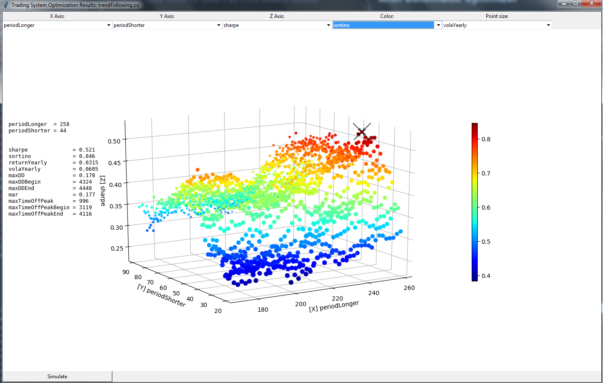

## Quantiacs Python Toolkit for Python 2 and 3 with automatic parallel optimizer

Python version of [Quantiacs](https://www.quantiacs.com/Home.aspx) toolbox. 

The Quantiacs Toolbox helps you with the development and the backtesting of your trading algorithms. 
Follow the steps in [GET STARTED](https://www.quantiacs.com/For-Quants/GetStarted/GetStarted.aspx) to create and run a sample trading algorithm.

For documentation, please visit [Quantiacs Python Toolbox documentation](http://quantiacs-python-toolbox-documentation.readthedocs.io/en/latest/).

### Automatic optimizer
To use optimizer:
* Define parameter ranges in format `#%[startValue:step:stopValue]#` as comments after parameters initialization.
Parameters can be defined anywhere in source file but for the best performance all of them should be defined at global scope.
Only integer ranges are supported. 

```python
periodLonger = 200  #%[170:2:260]#
periodShorter = 40  #%[20:2:90]#
```
* Call optimizer
```python
if __name__ == "__main__":
    import quantiacsToolbox
    quantiacsToolbox.optimize()
```



* Optimize parameters:
```
    :param tradingSystemFileName: file containing source code of trading system; if equals to None a file with __main__
           module will be used.
    :param reloadData: if set to True data used by trading system will be reloaded once before optimization process.
    :param sourceData: directory name containing data.
    :param processes: number of parallel processes performing optimization; must be lower than number of available
           cores in local CPU.
    :param outputFileName: file name where results will be stored.
    :param plot: if set to True - at the end optimization chart will be displayed
    :param chunkSize: number of jobs passed to one process at once; in case of large optimization spaces bigger chunk
           sizes can significantly decrease optimization time.
```

* All optimization results are always saved to file and can be later plotted with command:
```
quantiacsToolbox.plotOptimizationResult(fileName)
```

